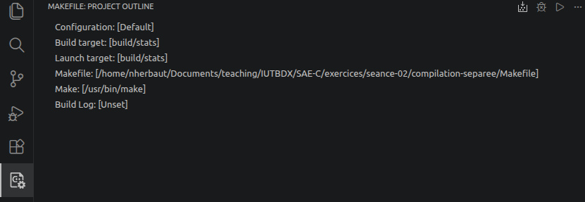
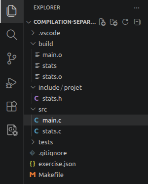
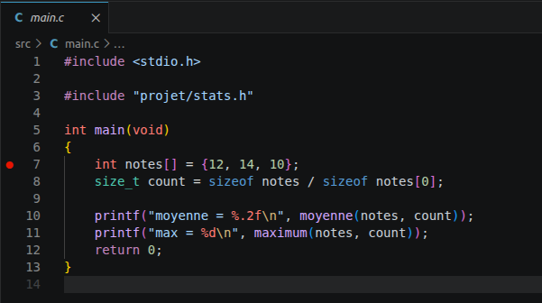
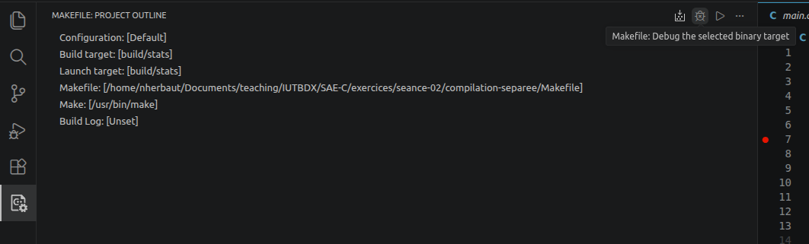

# Jalons autonomes

Les jalons structurent le travail personnel à réaliser entre les phases encadrées.

Les modalités de rendu et la répartition de la note sont décrites dans la page
[Évaluation de la SAE C](evaluation.html).

## Jalon autonome 1 - Comprendre le projet

Sans modifier le projet, clonez le dépôt, ouvrez le projet dans VS Code et
vérifiez l'environnement avec `make check-tools`, `make`, `make test` et
`make cppcheck`.

Lisez ensuite le README du projet capteurs, consultez les attendus pour le
rapport et proposez des cas de test pour minimum, maximum, moyenne et écart
intérieur-extérieur.

Le [sujet du projet capteurs est également disponible au format PDF](assets/pdf/projet-capteurs.pdf).

Notez les questions et difficultés que vous avez eux, nous les aborderons pendant la phase 2.

### Prise en main locale

La prise en main locale est réalisée pendant ce jalon. Vérifiez les choix de
tests proposés et notez les erreurs rencontrées pendant le clonage, la
compilation, l'exécution ou l'analyse statique.

### Cloner le depot

```todo
Dans un terminal, clonez le depot puis ouvrez le dossier du projet avec les commandes ci-dessous.
```

```bash {playback=typing}
## Clone du projet
# à partir de gitlab
(base) nherbaut@ares:~/tmp$ git clone https://github.com/nherbaut/BUT-INFO-S3-SAE-C.git
##

Cloning into 'BUT-INFO-S3-SAE-C'...
remote: Enumerating objects: 468, done.
remote: Counting objects: 100% (468/468), done.
remote: Compressing objects: 100% (311/311), done.
remote: Total 468 (delta 167), reused 409 (delta 109), pack-reused 0 (from 0)
Receiving objects: 100% (468/468), 2.78 MiB | 11.39 MiB/s, done.
Resolving deltas: 100% (167/167), done.

## ouvrir le projet
# On ouvre le répertoire du projet
(base) nherbaut@ares:~/tmp$ cd BUT-INFO-S3-SAE-C/projet/capteurs-starter/
##

## Utilisation du Makefile
# l'outil make utilise le fichier Makefile pour savoir comment réaliser toutes les opérations du cycle de développement. Compilation, exécution de test, lancement du programme, vérification de la mémoire...
# l'argument passé à make est appelé une **target**.
# Ici, la target `build/capteurs` construit le projet
(base) nherbaut@ares:~/tmp/BUT-INFO-S3-SAE-C/projet/capteurs-starter$ make build/capteurs
##

mkdir -p build

## Exécution du préprocesseur et compilation au stade objet.
# Cette série de commandes exécutée par le Makefile réalise deux opérations en un seule commande
# 1/ le préprocesseur. Celui-ci modifie le code source en utilisant les directives telles que #ifdef #define...
# 2/ la compilation au stade objet. Le code C est transformé en code machine non exécutable et en symboles en attente de liaison
cc -Iinclude -Iprovided/cjson -I/usr/include/x86_64-linux-gnu -std=c11 -Wall -Wextra -Wpedantic -c src/main.c -o build/main.o
##
## Détail d'une commande de compilation
# Ici, on appelle le compilateur (via son alias cc)
cc \
##
## Headers
# Ici, on spécifie quels sont les répertoire contenant les headers c (*.h)
-Iinclude -Iprovided/cjson -I/usr/include/x86_64-linux-gnu \
##
## Options de compilation
# Ici, on spécifie le standard C à utiliser (C11), et le niveau de Warning retourné:
# all: tous les warning
# extra: encore plus de warning
# pedantic: respect strict du standard C
-std=c11 -Wall -Wextra -Wpedantic\
##
## Spécification du source
# Le source est ensuite passé à l'aide de l'option -c
-c src/series.c\
##
## Specification de la cible
# Le fichier objet cible à créer est ensuite indiqué
-o build/series.o
##
## *.c => *.c
# Pour chaque fichier sources l'opération est répétée
cc -Iinclude -Iprovided/cjson -I/usr/include/x86_64-linux-gnu -std=c11 -Wall -Wextra -Wpedantic -c src/statistics.c -o build/statistics.o
cc -Iinclude -Iprovided/cjson -I/usr/include/x86_64-linux-gnu -std=c11 -Wall -Wextra -Wpedantic -c provided/sensor_source.c -o build/sensor_source.o
cc -Iinclude -Iprovided/cjson -I/usr/include/x86_64-linux-gnu -std=c11 -Wall -Wextra -Wpedantic -c src/report.c -o build/report.o
cc -Iinclude -Iprovided/cjson -I/usr/include/x86_64-linux-gnu -std=c11 -Wall -Wextra -Wpedantic -c provided/cjson/cJSON.c -o build/cJSON.o
##

## Edition de liens
# Dernière étape de la compilation, le linker prend les fichiers objets produits (*.o), les librairies tières pour générer un exécutable unique.
cc \
##
## On commence par les objets
build/main.o build/series.o build/statistics.o build/sensor_source.o build/report.o build/cJSON.o\
##
## Puis les librairies tierces (ici, math et curl)
-lm -lcurl  \
##
## Et on finit par spécifier le nom de l'exécutable
-o build/capteurs
##
```

### Vérifier les outils

```todo
Depuis `projet/capteurs-starter`, exécutez `make check-tools`, puis `make cppcheck`.
```

`check-tools` vérifie que le compilateur, Make, `pkg-config`, `libcurl` et
`cppcheck` sont disponibles. `cppcheck` analyse uniquement `src/`, c'est-à-dire
le code à modifier ; il n'analyse ni le réseau ni le parseur JSON fournis.

### Première préparation des statistiques

Avant d'écrire les statistiques du projet, proposez sur papier les signatures
de deux fonctions sur un tableau de mesures : une fonction de minimum et une
fonction de maximum. Précisez les paramètres nécessaires et le comportement
attendu lorsque le tableau est vide. Ces choix seront discutés avant le jalon 2.

### Ouvrir le projet avec VS Code

Avant d'ouvrir le projet avec vscode, nous devons installer 2 extensions utiles pour le développement C.

```todo
Dans un terminal, tapez les commandes suivantes:
```

```bash
code  --install-extension ms-vscode.makefile-tools
code  --install-extension ms-vscode.cpptools-extension-pack
```

Ouvez ensuite le répertoire `exercices/seance-02/compilation-separee` avec vscode (File>Open Folder)

Vous devez ensuite configurer VSCode pour qu'il utilise les bonnes target du makefile:

```todo
reproduisez la configuration suivante
```



Ensuite, ouvrez le fichier `main.c` qui se trouve dans ./src



Placez un point d'arrêt ligne 7 (point rouge) en cliquant dans la goutière.



Puis lancez le debug du programme dans l'extension Makefile.



Vous pouvez ensuite utiliser la petite boite de contrôle du debugger ou les raccourcis clavier pour naviguer dans l'exécution de votre code.


```todo
lancez le programme en debug, et naviguez dans l'éxécution de votre code. Constatez d'un survol des variables en cours d'exécution affiche leur valeur
```

## Jalon autonome 2 - Statistiques sans allocation dynamique

Implémentez `temperature_statistics_compute` et
`temperature_average_gap`. Le test `tests/test_statistics.c` construit deja un
tableau de mesures sur la pile : il n'y a donc encore ni `malloc` ni `realloc` a
utiliser.

```bash
cd projet/capteurs-starter
make test-statistics
```

## Jalon autonome 3 - Serie dynamique et version finale du projet

Implémentez `measure_series_append` et `measure_series_clear`,
puis le rapport terminal. Le test de serie ajoute 17 mesures afin de forcer
l'agrandissement du tableau.

```bash
cd projet/capteurs-starter
make test-series
make test
make memcheck
```

La version obtenue est celle apportee a la phase finale.
