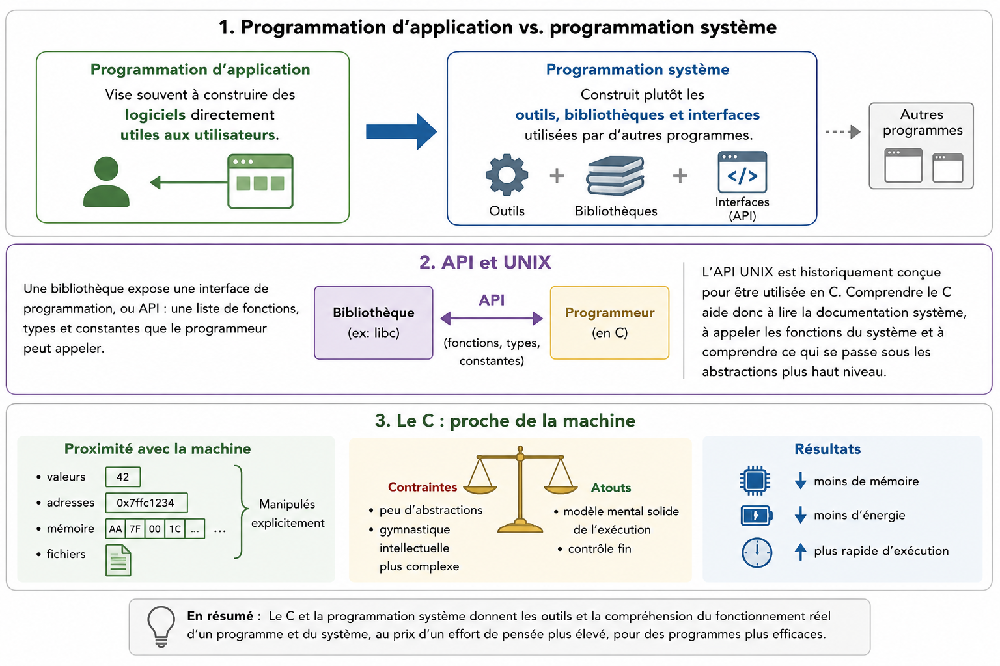

# Phase 1 - Premiers programmes C

## Hello, World

{{ c_exercise: exercices/seance-01/bonjour }}

## Objectifs

- Situer le langage C dans la programmation système.
- Lire et expliquer un programme C minimal.
- Compiler et executer un programme court dans le navigateur.
- Retrouver le meme exercice dans le depot local.
- Identifier les ressemblances et differences initiales avec Java.
- Manipuler des variables, conditions, boucles et tableaux simples.

{.course-full-width-image}

### Pourquoi programmer en C ?

Ce cours prepare la programmation système. La **programmation d'application** vise souvent a construire des **logiciels** directement **utiles aux utilisateurs**. La **programmation système construit** plutôt les **outils**, **bibliothèques** et **interfaces** utilisées par d'autres programmes.

Une bibliothèque expose une interface de programmation, ou API : une liste de fonctions, types et constantes que le programmeur peut appeler. L'API UNIX est historiquement conçue pour être utilisée en C. Comprendre le C aide donc a lire la documentation système, a appeler les fonctions du système et a comprendre ce qui se passe sous les abstractions plus haut niveau.

Le C est aussi un langage proche de la machine : les valeurs, les adresses, les zones mémoire et les fichiers y sont manipules explicitement. Cette proximité est une contrainte, mais aussi un outil pour former un modèle mental solide de l'execution d'un programme.

L'absence d'abstraction contrairement aux languages de plus haut niveau permet d'obtenir des programmes plus économes en mémoire, énergie et plus rapides d'exécution au détriment d'une gymnastique intellectuelle plus complexe.

```remember

Le langage C apparait au debut des années 1970, dans le contexte du système UNIX, avec Dennis Ritchie et Ken Thompson. Il est influence par BCPL et B, puis popularise par le livre *The C Programming Language* de Brian Kernighan et Dennis Ritchie.

Quelques repères suffisent pour ce cours :

- 1972 : développement de C avec UNIX.
- 1978 : publication du livre K&R.
- 1989 : standard ANSI C, souvent appelé C89.
- 1990 : standard ISO C90.
- 1999 : C99.
- 2011 : C11, la base retenue dans nos options de compilation.
```

::: quiz {#quiz-s1-histoire}
title: Repères C et UNIX

::: question {#q-s1-c-système}
title: Pourquoi le C est-il utile avant la programmation système ?
description: On cherche surtout le lien avec les API système.

- [x] Parce que l'API UNIX est historiquement exposée en C
- [ ] Parce que le C cache toujours la mémoire au programmeur
  hint: Au contraire, le C rend beaucoup de manipulations mémoire explicites.
- [x] Parce qu'il aide a comprendre les appels de bibliothèques bas niveau
- [ ] Parce que C est une variante de Java
:::
:::

## Programme minimal

Un programme C contient une fonction `main`. C'est le point d'entree execute au
lancement du programme.

```c {playback=typing}
/**
 * Fichiers d'en-tete
 *
 * Les declarations de la bibliotheque standard sont importees avant
 * d'utiliser les fonctions et constantes correspondantes.
 */
#include <stdio.h>
#include <stdlib.h>
/** */

/**
 * Point d'entree
 *
 * main est la première fonction executée. Elle retourne un code entier au
 * systeme pour indiquer la fin du programme.
 */
int main(void)
{
/** */

/** Affichage
 * 
 * printf est utilisé pour l'affichage de text. Attention à bien ajouter \n à la fin de la ligne
 */
    printf("Hello World!\n");
/** */

/** Retour du programme
 * 
 * Le code de retour du programme est la valeur (int) retournée par la fonction main.
 * Il est transmis à l'OS et à l'utilisateur.
 */
    return EXIT_SUCCESS;
/** */
}

```

Ce programme :

- inclut des declarations fournies par des fichiers d'en-tête ;
- appelle `printf` pour afficher sur la sortie standard ;
- termine la ligne avec `\n` ;
- retourne un code de fin d'execution au système.

La forme `int main(void)` indique que `main` ne reçoit aucun argument et retourne
un entier. Par convention, ce code de retour indique si le programme s'est termine
correctement. `EXIT_SUCCESS`, defini dans `stdlib.h`, exprime une terminaison
reussie.

## Syntaxe et fonction de base

La syntaxe de base du C est très proche du Java "old school", qui s'en inspire. Chaque instruction est séparés par un `;`, les `{}` servent à délimiter des blocs de code, if/for/while sont similaire.

Il y a des différences syntaxiques qu'ils faut quand même connaître.

### Variables et types simples

Une variable C contient directement une valeur du type annonce. Pour un premier
programme, on peut raisonner comme en Java sur les entiers, les conditions et les
boucles, mais il faut garder en tête que C fait peu de contrôles automatiques.

**Attention** les exemples sont donnés sans le contexte complet du programme. En C, contrairement au python, le code doit être impérativement dans une fonction.

```c
int note = 12;
int seuil = 10;

if (note >= seuil) {
    printf("valide\n");
}
```

Le type `int` représente un entier. La variable `note` contient ici la valeur
`12`, pas une référence vers un objet.

::: quiz {#quiz-s1-types}
title: Types et variables

::: question {#q-s1-variable-int}
title: Que stocke les variables ?
description: On declare `int note = 12;`.

- [x] Une valeur entière copiée dans la variable
- [ ] Une référence vers un objet
  hint: En C, une variable simple contient directement sa valeur.
- [ ] Une chaine de caractères
:::
:::

### Conditions

Les conditions ressemblent à Java sur la syntaxe de base.

```c
if (a > b) {
    printf("a est plus grand\n");
} else {
    printf("b est plus grand ou egal\n");
}
```

L'exercice suivant demande d'identifier un maximum. Il sert à vérifier les
conditions, les variables et l'affichage.

{{ c_exercise: exercices/seance-01/max3 }}

### Boucles

Les boucles `while` et `for` existent aussi en C.

```c {playback=typing}
/** Librairies
 * 
 * On inclue les librairies standard
 */
#include <stdio.h>
#include <stdlib.h>
/**  */

int main(void)
{

  /** Déclaration de variable
   * 
   * On commence par déclarer la variable (innutile de lui donner une valeur)
   */
  int max;
  /** */

  /** Lecture valeur dans le stdin
   * 
   * scanf, comme printf est formaté, et utilise un formatage très proche de java.
   * Ici, on passe l'adresse de la variable max, afin que la fonction scanf puisse
   * modifier sa valeur.
  */

  scanf("%d",&max);
  /**  */

  /** Boucle For 
   * 
   * La structure générale est proche de Java : initialisation, condition et
   * incrément sont regroupés entre parenthèses. Nous utilisons cependant la
   * norme C11 dans ce cours, et les types, tableaux et objets n'ont pas le
   * même comportement qu'en Java.
   */
  for (int i= 0; i < max; i++) {
 
      printf("%d\n", i);
  }
  /** */


return 0;

}
```

```trap
La boucle ci-dessus affiche les valeurs de `0` a `4`. Cette convention est importante pour les tableaux : le premier indice est `0`.
```

### Tranformez cette boucle for en boucle while

```c 
#include <stdio.h>
#include <stdlib.h>


int main(void)
{
int i;

}
```


#### Tableaux simples

Du point de vue algorithmique, un tableau est une collection de données du même
type, accessibles par un indice entier. En C, un tableau est aussi une zone
mémoire contenant des éléments consécutifs.

```c {playback=typing}
/** Declaration du tableau
 *
 * Cette declaration reserve trois entiers et initialise leurs valeurs. Les
 * indices valides du tableau sont 0, 1 et 2.
 */
int notes[] = {12, 14, 9};
/** */

/** autre syntaxe
 * 
 * Il est aussi possible de déclarer un tableau vide et d'initialiser ses valeurs
 * explicitement
 */
int notes[3];
notes[0]=12;
notes[1]=14;
notes[2]=9;
/** */

/** taille du tableau 
 * 
 * Cette déclaration ne compile pas : sans initialiseur, C ne peut pas déduire
 * la taille du tableau. Les deux déclarations précédentes, avec initialiseur
 * ou avec taille explicite, sont valides.
*/
int notes[]; // erreur de compilation ici!
/** */

/** Calcul de la somme
 *
 * La boucle parcourt chaque indice valide. A chaque iteration, la valeur de
 * l'element courant est ajoutee a la somme.
 */
int somme = 0;
int i;

for (i = 0; i < 3; i++) {
    somme += notes[i];
}
/** */

/** Affichage du resultat
 *
 * La valeur calculee est finalement envoyee sur la sortie standard.
 */
printf("somme = %d\n", somme);
/** */
```

Pour cette phase, on retient surtout :

```remember
  
* Tous les éléments d'un tableau ont le même type ;
* L'indice du premier élément est `0` ;
* La taille indiquée dans une déclaration réserve de la place ;
* Accéder hors des bornes est une erreur que C ne détecte pas toujours.

```

::: quiz {#quiz-s1-tableaux}
title: Tableaux simples

::: question {#q-s1-indices-tableau}
title: Quelles affirmations décrivent un tableau C simple ?
description: On declare `int notes[3] = {12, 14, 9};`.

- [x] Le premier élément est `notes[0]`
- [x] Le tableau contient des éléments de même type
- [ ] `notes[3]` désigne le troisième élément
  hint: Avec trois éléments, les indices valides sont 0, 1 et 2.
- [x] La déclaration réserve de la place pour trois entiers
:::
:::


### Fichiers d'en-tête

Un fichier d'en-tête, ou header, contient des declarations nécessaires au compilateur. Il ne contient pas forcement le code complet de la fonction appelée, mais il annonce son existence et sa forme.

Dans l'exemple precedent :

- `#include <stdio.h>` donne accès a la declaration de `printf` ;
- `#include <stdlib.h>` donne accès a `EXIT_SUCCESS` ;
- les chevrons `<...>` désignent un header fourni par le système ou la
  bibliothèque standard.

Cette distinction entre declaration et definition deviendra essentielle avec la
compilation séparée en phase 2.

### Entrées-sorties et adresses

{{ c_demo: exercices/seance-01/moyenne }}

Les entrées-sorties font circuler des valeurs entre le programme et son
environnement : `printf` écrit sur la sortie standard et `scanf` analyse des
valeurs saisies sur l'entrée standard. Ces deux fonctions introduisent une
première différence importante entre une valeur et l'adresse d'un emplacement
en mémoire.

#### Afficher avec `printf`

`printf` écrit sur la sortie standard. Le caractère `\n` représente un retour à
la ligne. C'est une fonction d'**affichage formaté** : son premier paramètre est
une chaîne de format qui décrit ce qui sera affiché. Les morceaux ordinaires de
cette chaîne sont reproduits tels quels; les spécificateurs commençant par `%`
forment des emplacements à compléter avec les paramètres suivants.

```c
int note = 14;
char prenom[] = "Ada";

printf("%s a obtenu %d\n", prenom, note);
```

Dans cet exemple, `%s` est remplacé par la chaîne `prenom` et `%d` par la
valeur de `note`. Pour `%d`, on fournit la valeur d'une expression, qui peut
être une variable ou un calcul. Pour `%s`, on fournit l'emplacement de la
chaîne : dans le cas d'un tableau de `char`, son nom représente l'adresse de
son premier caractère. La chaîne se termine par le caractère spécial `\0`.

| Code de format | Argument attendu | Exemple |
| --- | --- | --- |
| `%d` | `int`, en décimal signé | `printf("%d", note);` |
| `%u` | `unsigned int`, en décimal non signé | `printf("%u", compteur);` |
| `%ld` | `long`, en décimal signé | `printf("%ld", total);` |
| `%zu` | `size_t`, notamment pour une taille ou un indice | `printf("%zu", count);` |
| `%c` | caractère stocké dans un `char` | `printf("%c", lettre);` |
| `%s` | adresse d'une chaîne de caractères, par exemple `char[]` ou `char *` | `printf("%s", prenom);` |
| `%f` | `double` ou `float` converti en `double` lors de l'appel | `printf("%.2f", moyenne);` |
| `%%` | aucun argument : affiche le caractère `%` | `printf("100%%");` |

Le code de format doit correspondre au type de l'argument. Une incohérence peut
produire un warning ou un comportement indéfini : les warnings de compilation
doivent donc être lus et corrigés.

#### Lire avec `scanf`

Lire une valeur consiste à analyser ce qui a été saisi puis à placer la valeur
correspondante quelque part en mémoire. Comme `printf`, `scanf` reçoit d'abord
une chaîne de format. Les paramètres suivants désignent les emplacements dans
lesquels la fonction doit placer les valeurs lues.

Pour lire un entier, il faut fournir l'adresse de la variable :

```c
int annee;

scanf("%d", &annee);
```

L'opérateur `&`, dit *address-of*, produit l'adresse de la variable `annee`.
Cette adresse permet à `scanf` de modifier la variable située à cet emplacement
en mémoire. À ce stade, il suffit de retenir que `scanf` a besoin de savoir où
écrire la valeur lue.

Le principe est le même pour une chaîne de caractères, qui est stockée dans un
tableau de `char` :

```c
char nom[50];

scanf("%s", nom);
```

Ici, `nom` représente déjà l'adresse du premier caractère du tableau; il ne
faut donc pas écrire `&nom`. Le format `%s` lit un mot et s'arrête au premier
espace. Le tableau doit être assez grand pour contenir les caractères lus et le
caractère final `\0`.

```warning
Avec un vrai programme, il faut toujours limiter le nombre de caractères lus.
Pour un tableau `char nom[50]`, on écrira `scanf("%49s", nom);` afin de laisser
une place pour le caractère final `\0` et d'éviter un dépassement de tableau.
```

::: quiz {#quiz-s1-programme-minimal}
title: Programme minimal

::: question {#q-s1-main-headers}
title: Quelles affirmations sont correctes ?
description: On considere le programme `hello.c` minimal.

- [x] `main` est le point d'entree du programme
- [x] `stdio.h` declare notamment `printf`
- [ ] `printf` definit le code de retour du programme
  hint: Le code de retour vient de l'instruction `return` de `main`.
- [x] `\n` permet d'afficher un retour a la ligne
:::
:::

## Compiler, exécuter, tester

### Compilation

Pendant cette premiere phase, les exercices peuvent être lances dans le
navigateur. Cela permet de se concentrer d'abord sur le langage : variables, conditions, boucles et affichage.

La commande locale complete sera reprise en phase 2. Retenir seulement l'idée
générale pour un programme simple :

```bash
gcc -std=c11 -Wall -Wextra -pedantic -g hello.c -o hello
./hello
```

`gcc` transforme le fichier source `hello.c` en exécutable. Les options activent
un dialecte C précisé et des avertissements utiles.


### Tester par entrées/sorties attendues

Au début du cours, les tests peuvent rester simples : on donne des valeurs en
entrée standard et on compare la sortie produite à une sortie attendue.

Exemple de commande locale :

```bash
printf "12 14\n" | ./moyenne
```

Le programme lit les valeurs comme si elles avaient été tapées au clavier.

On peut aussi démarer simplement le programme et taper avec son clavier les valeurs attendues lorsque `scanf` bloque l'exécution en attente de lecture sur l'entrée standard (`stdin`)


### Executer (dans le navigateur)

Le système intégré à la page compile et exécute des programmes courts. Il ne remplace pas GCC/Clang, mais il suffit pour manipuler les premières notions sans installer l'outillage pendant la phase 1.


```tip

Les mêmes exercices existent dans le dépôt. Quand l'environnement local est utilisé, les commandes deviennent :


<pre>
cd exercices/seance-01/moyenne
make run
make test
</pre>


La prise en main détaillée du compilateur, des Makefiles et de l'organisation des
fichiers est l'objectif de la phase 2.
```

## Présentation rapide du projet

Le projet capteurs analysera des mesures de temperature fournies par une bibliotheque. 

Le flux de donnée est récupéré sur le reseau (https) au format JSON, nous avons déjà écrit pour vous la partie du code qui réaliser la récupération et le parsing des données.
Il faut reste à faire les tâches suivantes:
- structures
- les calculs
- la memoire dynamique
- les tests 
- le rapport

## Pour vous entrainer

```todo
Hello personnalise : afficher un message et retourner `EXIT_SUCCESS`.
```

```todo
Calcul de moyenne.
```

```todo
Moyenne de trois entiers.
```
```todo
Comptage des notes supérieures à 10 dans le tableau
```

```todo
Somme des éléments d'un tableau d'entiers.
```
